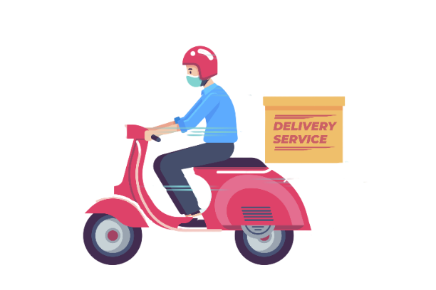
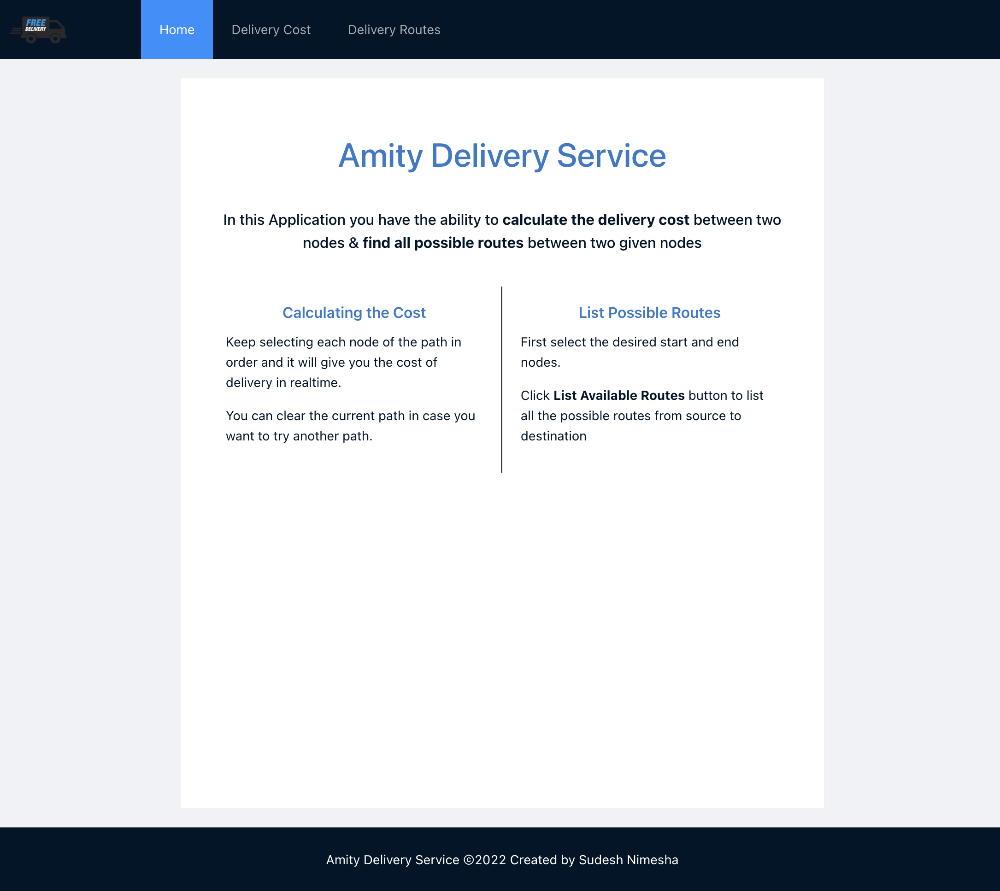
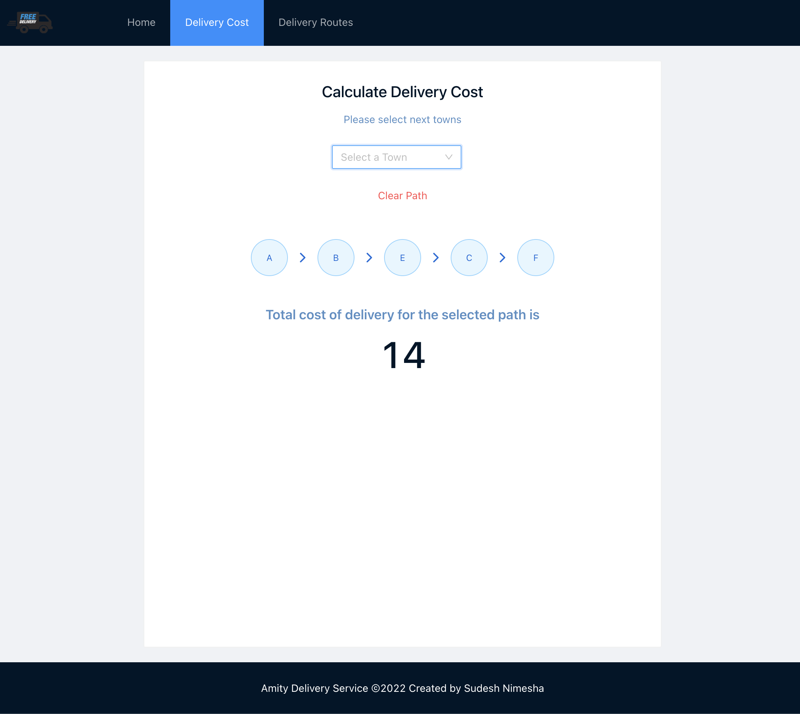
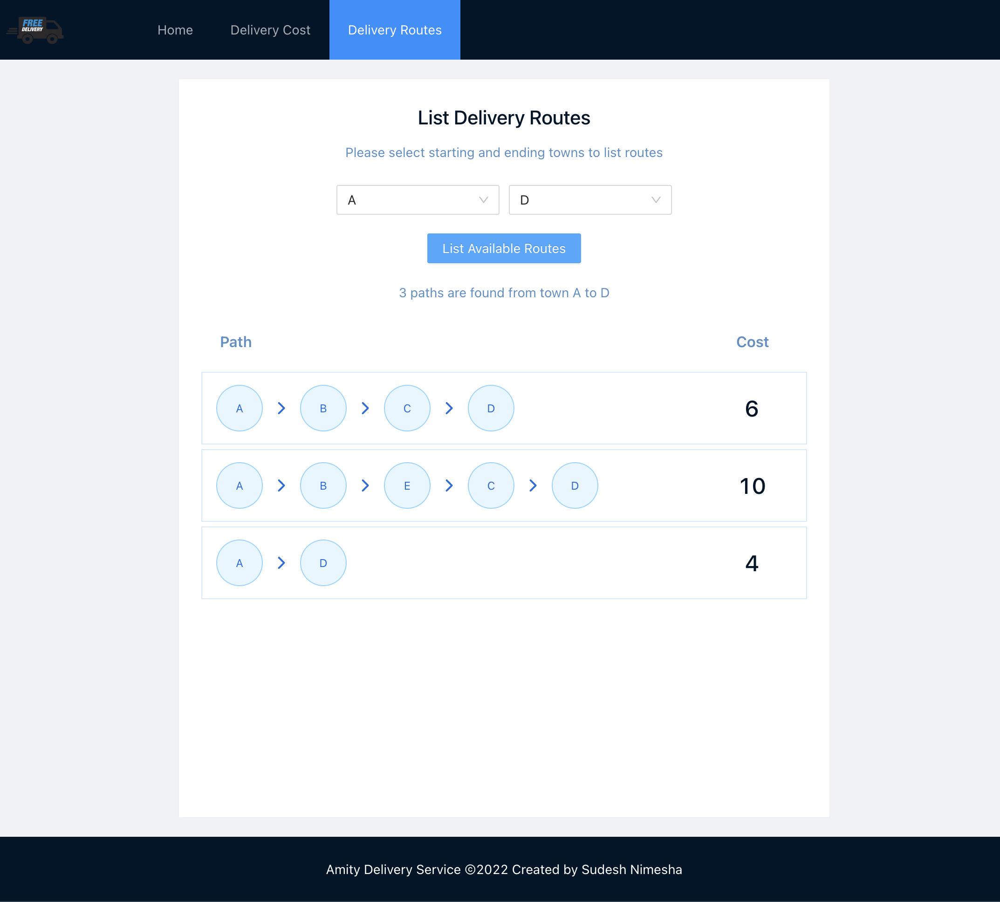

<div id="top"></div>
<div align="center">

[![LinkedIn][linkedin-shield]][linkedin-url]

</div>

<!-- PROJECT LOGO -->
<br />
<div align="center">
  <a href="https://amity-delivery-service.web.app">
    
  </a>
  <h1 align="center">Amity Delivery Service</h1>
  <p align="center">
    Application to calculate delivery cost between towns and list all possible delivery paths between two towns.
    <br />
    <a href="https://amity-delivery-service.web.app"><strong>View Demo »</strong></a>
    <br />
    <br />
  </p>
</div>
<!-- TABLE OF CONTENTS -->
<details>
  <summary>Table of Contents</summary>
  <ol>
    <li>
      <a href="#about-the-project">About The Project</a>
      <ul>
        <li><a href="#built-with">Built With</a></li>
      </ul>
    </li>
    <li>
      <a href="#getting-started">Getting Started</a>
      <ul>
        <li><a href="#prerequisites">Prerequisites</a></li>
        <li><a href="#installation">Installation</a></li>
      </ul>
    </li>
    <li><a href="#contributing">Contributing</a></li>
    <li><a href="#contact">Contact</a></li>
  </ol>
</details>

<!-- ABOUT THE PROJECT -->

## About The Project

<div align="center">
  
  
  
</div>

In this Application you have the ability to

- Calculate the delivery cost between two nodes
- Find all possible routes between two given nodes

<p align="right">(<a href="#top">back to top</a>)</p>

### Built With

- I have used the free json host to host the graph data [jsonbin.io](https://jsonbin.io/)
- I have used [firebase](https://firebase.google.com/) storage to temporarily host this application to provide a quick preview to the observers.

- [React.js](https://reactjs.org/)
- [Typescript](https://www.typescriptlang.org/)
- [Ant Design](https://ant.design/)
- [Styled Components](https://styled-components.com/)
- [Lodash](https://lodash.com/)
- [Axios](https://www.npmjs.com/package/axios)

<p align="right">(<a href="#top">back to top</a>)</p>

<!-- GETTING STARTED -->

## Getting Started

This project was bootstrapped with Create React App with typescript template.

### Prerequisites

Make sure you have node installed in order to run this application locally.

- upgrade npm to the latest version

```sh
npm install npm@latest -g
```

### Installation

1. Clone the repo

```sh
git clone https://github.com/sudeshnt/amity-delivery-service.git
```

2. Install node modules

```sh
npm install
```

3. In the project directory, you can run:

```js
npm start
```

4. Runs the app in the development mode.

Open [http://localhost:3000](http://localhost:3000) to view it in your browser

5. Launches the test runner in the interactive watch mode.

```js
npm test
```

6. Builds the app for production to the build folder.

```js
npm build
```

<p align="right">(<a href="#top">back to top</a>)</p>

<!-- CONTRIBUTING -->

## Contributing

Contributions are what make the open source community such an amazing place to learn, inspire, and create. Any contributions you make are **greatly appreciated**.

If you have a suggestion that would make this better, please fork the repo and create a pull request. You can also simply open an issue with the tag "enhancement".
Don't forget to give the project a star! Thanks again!

1. Fork the Project
2. Create your Feature Branch (`git checkout -b feature/AmazingFeature`)
3. Commit your Changes (`git commit -m 'Add some AmazingFeature'`)
4. Push to the Branch (`git push origin feature/AmazingFeature`)
5. Open a Pull Request

<p align="right">(<a href="#top">back to top</a>)</p>

<!-- CONTACT -->

## Contact

Sudesh Nimesha - sudeshnt93@gmail.com

<p align="right">(<a href="#top">back to top</a>)</p>

<!-- MARKDOWN LINKS & IMAGES -->
<!-- https://www.markdownguide.org/basic-syntax/#reference-style-links -->

[linkedin-shield]: https://img.shields.io/badge/-LinkedIn-black.svg?style=for-the-badge&logo=linkedin&colorB=555
[linkedin-url]: https://www.linkedin.com/in/sudeshnt
